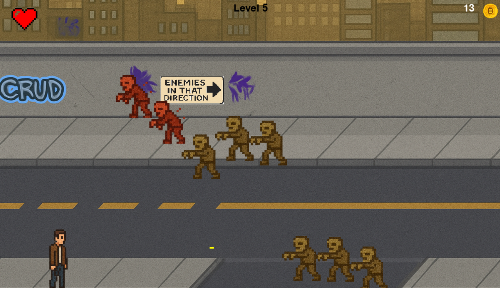

# 🧟‍♂️ Zombie Survival Arcade

A fast-paced 2D arcade-style shooter built with Python and Pygame.  
Survive waves of zombies, collect coins, and upgrade your abilities through the in-game shop.

---

## 🎮 Gameplay Features

- 💀 Zombies spawn in waves and get stronger over time  
- 💰 Collect coins from defeated zombies  
- 🛒 Access a shop to upgrade your fire rate or restore health  
- 🎨 Basic animations with scaled pixel sprites
- 🎯 Responsive movement and shooting mechanics
- 🧠 Minimalist AI movement with collision detection  

---

## 🕹️ Controls

| Key             | Action              |
|-----------------|---------------------|
| `W` `A` `S` `D` | Move player         |
| `SPACE`         | Shoot               |
| `1`             | Buy heart (in shop) |
| `2`             | Upgrade fire rate   |

---

## 🚀 Getting Started

### Requirements
- Python 3.8 or higher
- [Pygame](https://www.pygame.org/)

### Install Pygame

```bash
pip install pygame
```

### Run the Game
```bash
python main.py
```

All images and sounds are stored in the `assets/` folder.



---

## 📦 Credits

**Code:** Written by me with some AI-assisted structuring  
**Assets:** Custom-made or sourced from free-use libraries

