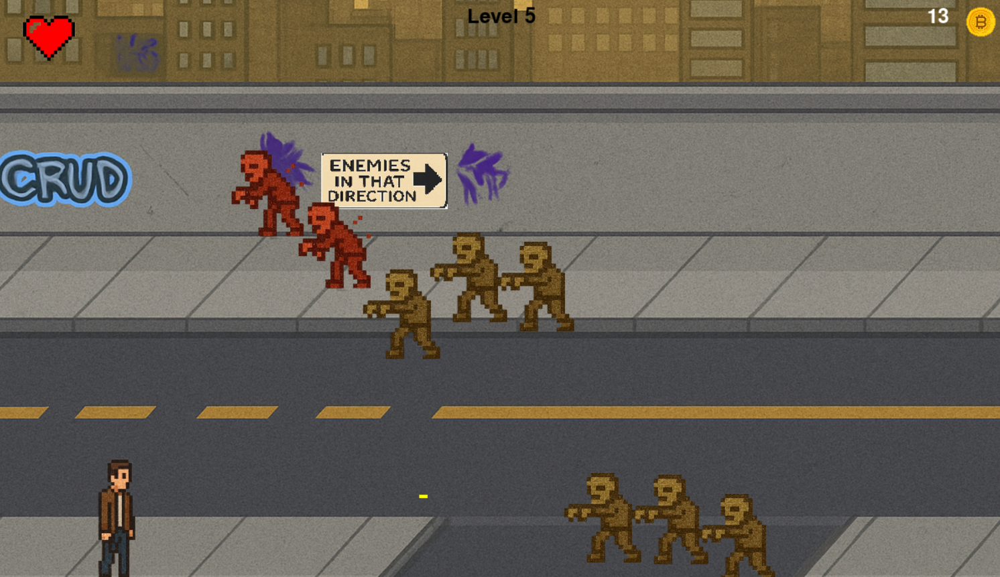

# 🧟‍♂️ Zombie Survival Arcade

A fast-paced 2D arcade-style shooter built with Python and Pygame.
Survive waves of zombies, collect coins, and upgrade your abilities through the in-game shop.

---

## 🎮 Gameplay Features

- 💀 Zombies spawn in waves and get stronger over time
- 💰 Collect coins from defeated zombies
- 🛒 Access a shop to upgrade your fire rate or restore health
- 💡 Smooth animations and responsive controls
- 🧠 Minimalist AI movement with collision detection

---

## 🕹️ Controls

| Key             | Action              |
|-----------------|---------------------|
| `W` `A` `S` `D` | Move player         |
| `SPACE`         | Shoot               |
| `1`             | Buy heart (in shop) |
| `2`             | Upgrade fire rate   |

---

## 🚀 Getting Started

### Requirements:
- Python 3.8 or higher
- [Pygame](https://www.pygame.org/)

### Install Pygame:
```cmd
pip install pygame

All images and sounds are stored in the assets folder.


## Credits

Code: Me (and ChatGPT for debugging and modularization)
All assets are either made by me, ChatGPT or sourced from free-to-use repositories.
